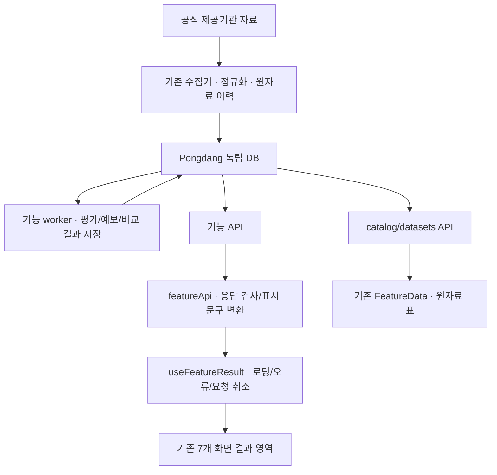

# Pongdang 백엔드 구현 및 프론트 연결 설명

프론트 담당자 전달용 · 경수 백엔드 작업 · 2026-09-14 KST

기준 코드: 구현 커밋 `c1c3eb1`, 후속 검증 문서 포함 `1cb83de`.
요구사항: `backend/BACKEND_GOAL.md`. 실제 연결은 `frontend/src/featureApi.ts`,
`useFeatureResult.ts`, 각 페이지 컴포넌트를 대조했다.

## 1. 전달할 핵심 설명

> 기존 수집 구조와 Water Index를 확장하여 A1~A8의 데이터 처리·저장·주기 작업·API와 B의 근거 설명 기반을 구현했습니다. 프론트는 작업 시작 당시 디자인·메뉴·라우팅·자료표를 유지하고, 7개 화면의 기존 결과 문구와 조건부 공개 링크에 API 결과를 연결했습니다. 지도·차트·달력·알림 설정·리뷰 작성·AI 대화 UI는 새로 만들지 않았습니다. 현재 요약은 첫 수집 지점 또는 첫 조회 결과를 표시하므로, 다음 프론트 작업은 사용자 지점/시간 선택과 상세 DTO를 연결하는 것입니다.
>
> 기능별 처리 경로가 구현된 것과 검증된 제품 결과가 있는 것은 구분해야 합니다. Water Index의 수치 환경 모델은 아직 미구현이며 점수는 null입니다. 실제 라이브캠·리뷰·공식 활동 운영창은 자료 확보가 필요하고, SSO 사용자 전달·외부 알림·선택적 LLM은 운영 활성화 검증이 남아 있습니다.

## 2. 백엔드에서 구현한 것

아래 API는 `/api/data/` 기준 상대 경로다. 운영 외부 경로는 `/pongdang/api/data/…`다.
A1의 `support`, `coverage`는 각각 `water-index/support`, `water-index/coverage`를 뜻한다.

| 기능 | 구현한 처리와 API | 프론트가 받을 수 있는 정보 | 남아 있는 모델·자료·운영 조건 |
|---|---|---|---|
| **A1 Water Index** | 기존 판정기/불변 저장 확장, 실제 수집자료→평가 입력→실행/근거 저장, 5분 job. `GET water-index/assessments`, `support`, `coverage` | 평가 상태, 사용 입력, 계산/자료 버전과 근거, 활동 지원·자료 범위·보류 사유 | **수치 환경 적합도 모델 자체가 `unimplemented`이고 검증은 `not_evaluated`**. 점수·추천 순위 없음. 지원/제한·관측소 대표성 근거도 보강 필요 |
| **A2 Water Forecast** | 공식 예보를 별도 revision으로 저장, 5분 projection. `GET water-forecast/forecasts` | 제공기관, 발표시각, 예보 대상 구간, 수집시각, 원자료 ID/정정 이력, 예보 범위와 결측 상태 | 실제 공급 범위만 제공. 7일을 채우기 위한 보간/복제 없음. 검증된 방문 시점 추천 없음 |
| **A3 Water Twin** | 장소·지도 범위·활동·시각별 제한 조회, A1/A2 결과를 같은 조건으로 결합. `GET water-twin` | 장소 ID/이름/좌표/유형, 관측소 연결과 대표 범위, 레이어별 값·단위·상태·출처·시간, 중첩 평가/예보 | 새 지도 UI 없음. 여행 장소 대표 매핑 검수 필요. 복원할 수 없는 과거 이름/좌표는 null+사유 |
| **A4 수온 지도** | A3 공간 조회를 재사용하는 수온 전용 조회. `GET water-temperature` | 실제 수온, 단위, 관측소/좌표, 관측·수집·만료시각, 관측/예보 구분 | 가까운 관측소를 해변 직접 측정으로 취급하지 않음. 검증된 보간·입수 안전 판정 없음 |
| **A5 라이브캠** | 검수된 카메라/사용 조건/장소 등록 CLI, 불변 이력, 5분 URL 점검. `GET livecams` | 공개 제공 페이지, 제공기관, 영상 종류, 재생 방식·임베드 조건, 접근 상태/최근 확인 | 실제 검수 카메라 미등록. URL HEAD 접근 점검은 구현했으나 영상 재생·생중계 자체의 검증은 미구현 |
| **A6 물때 타이머** | 공식 고저조에서 다음 만조/간조 계산, 정정·자정 처리, 검수 운영창 저장. `GET tides/events`, `tides/windows` | 다음 고저조 시각과 기준시각, 기준시각에서 남은 초 `seconds_until`, 원자료·관측소·시간대, 근거가 있는 공식 운영창 | 실제 운영창/통제 자료 미등록. 간조 전후 시간을 임의로 안전한 체험 시간으로 만들지 않음 |
| **A7 조건 알림** | 기존 SSO 사용자별 구독 생성/조회/수정/해지, 수온 조건 평가, 이벤트/발송 대기열/재시도/취소, Resend adapter, 1분 job | 본인 구독 설정과 revision, 조건 평가/이벤트 이력, 연중 최초 여부, 발송 처리 상태 | SSO 사용자 전달 설정·발송 설정 검증 필요. 실제 발송 미실행. 수온 선호 충족은 입수 안전이 아니며 연간 이력이 부족하면 최초 여부 null |
| **A8 수질 교차검증** | 인증된 현장 관찰 입력·정정·철회, 부정 표현/중복/상충 처리, 비교 가능한 측정값의 차이 계산, 15분 저장 job. `GET quality/comparisons`, `GET/POST quality/observations` | 공식 검사/현장 관찰을 나눈 근거, 표본·기간·신선도·비교 가능 여부·차이와 사유 | 실제 리뷰 미확보로 `no_review_data`. 비교 가능한 공인 검사/측정 메타데이터와 관찰 추출 현장 검증 필요. 신뢰도%·안전 판정 없음 |
| **B AI 선행 기반** | `GET ai/tools` 제한 서비스 목록, `GET ai/explanation` 서버 근거 설명, 인증 `POST ai/explanation` 선택적 모델, 출력 검증/실패 대체/호출·토큰·비용 상한 | 실제 자료에서 만든 설명, fact ID와 근거 참조, 자료 상태·설명 방식·사유 | 프론트 연결 없음. 실제 LLM 호출·품질/비용 실측 없음. 모델은 기존 사실의 순서만 제안하며 B1~B5 전체 추천/대화 제품은 미구현 |

공통으로 독립 PostgreSQL의 `pongdang_data`를 사용한다. 명시적 migration으로 schema v5를 구성하며,
기존 자료를 보존한다. API 요청에서 수집·migration·예제 생성을 실행하지 않는다.
worker는 기존 DB 잠금, 실행 예정시각 저장, 실패 재시도 간격, heartbeat를 재사용한다.
Multtara의 코드·DB·네트워크·credentials에 의존하지 않는다.

## 3. 현재 프론트에 연결한 위치

기능 요약용 조회는 **1건**을 요청한다. 아래 표는 완성된 전체 화면이 아니라 실제 바인딩된 범위를 설명한다.

| 화면 / 파일 | 실제 호출 | 연결한 기존 영역과 표시 | 아직 연결하지 않은 UI |
|---|---|---|---|
| Water Index 허브 / `WaterIndexHubPage.tsx` | `water-twin?page_size=1`로 지점 확보 → `water-index/assessments` | `hub-note`에 평가 상태, 지점명, 입력 수, 평가시각 또는 미실행, 점수 없음 | 점수 카드·순위·활동/지점 선택, 지원/커버리지 상세 |
| Water Forecast / `WaterForecastPage.tsx` | 같은 지점 확보 → `water-forecast/forecasts` | `wf-datebar` 상태 문구와 `wf-hero-body` 설명에 제공기관·대상시각·발표시각 | 7일 그래프/달력, 기간 선택, 방문 추천. 큰 평가 문구는 여전히 “평가값 없음” |
| Water Index 지도 / `WaterIndexMapPage.tsx` | `water-twin?page_size=1` | `wim-panel` 지점 상세에 장소 상태와 첫 수온 레이어의 값·단위·관측소·측정시각 | 실제 지도/마커/레이어 조작. 지도 영역의 “연결된 지도가 없습니다.” 유지 |
| 라이브캠 / `LivecamHubPage.tsx` | `livecams?page_size=1` | 기존 영상 영역에 제공기관/접근 상태, 검증된 형식의 URL이 있으면 “공개 제공 페이지” 외부 링크. `lc-note`에 영상 구분 | 플레이어/자동재생/임베드, 지점별 카메라 선택 |
| 물때 타이머 / `TideTimerPage.tsx` | 같은 지점 확보 → `tides/events` | `tt-tide-pill`에 다음 만조/간조 시각, `tt-note`에 지점·기준시각 | 매초 줄어드는 countdown, 활동 시간창 표시. “계산된 활동 시간대가 없습니다.” 유지 |
| 올해 첫 입수 / `FirstSwimPage.tsx` | `notifications/events?limit=1` | 기존 두 결과 영역에 본인 이벤트 상태, 발생시각, 최초 여부, 발송 상태 또는 인증 오류 | 구독 생성/수정/해지 폼, 연도별 비교 그래프. 기존 “연도별 입수 비교” 제목 아래도 현재는 이벤트 설명 |
| 수질 / `WaterQualityPage.tsx` | `quality/comparisons?page_size=1` | 기존 “교차검증 결과” 패널에 저장된 비교 상태와 지점 ID, 근거 설명 | 리뷰 입력/정정/철회 폼, 표본/측정값 차이/출처 상세 비교 화면 |

**A4의 수온 전용 API가 준비되어 있어도 현재 화면에서 직접 호출하는 경로는 `water-twin`이다.**
이 응답의 `layers` 중 `water_temperature`를 읽어 상세 문구를 표시한다.
A1 `support/coverage`, A6 `windows`, A7 구독 변경, A8 관찰 입력, B AI API는 현재 화면에서 호출하지 않는다.

### 현재 지점·시간·갱신 방식

| 항목 | 현재 동작 | 프론트 확장 시 필요한 연결 |
|---|---|---|
| 지점 선택 | A1/A2/A3/A4/A6은 `water-twin` 첫 수집 지점 사용. 추천·최인접·사용자 선택 지점이 아님 | 공통 `selectedSpotId`를 만들고 같은 ID를 화면별 API에 전달 |
| A1 조건 | `activity=swim`, `profile_id=general`, `mode=observation`, 조회 시각 기준 1시간 전~24시간 후, `page_size=1` | 활동/기간/모드 UI가 생기면 해당 값으로 대체 |
| A2 조건 | `activity=swim`, 지금~24시간 후, `page_size=1` | 달력/그래프는 선택 기간과 페이지를 조회하고 실제 대상 구간을 사용 |
| A6 조건 | `activity=mudflat`, 지금~24시간 후, `page_size=1` | 타이머는 `reference_at`과 이벤트 시각을 사용. 갱신 때 새 예보 revision 반영 |
| A5/A8 범위 | 현재 `spot_id` 필터 없이 첫 결과 요청 | 장소 중심 화면이면 `spot_id` 필터 추가 |
| A7 범위 | 인증된 사용자 자신의 첫 이벤트 | 구독/장소 필터와 본인 이력 조회 연결 |
| 기능 요약 재조회 | 화면 마운트 또는 hook의 `feature` 변경 시 fetch. 자동 polling/실시간 스트림 없음 | 지점·활동·시각·갱신 키를 hook 의존성에 포함하고 취소 처리 유지 |
| 기존 “자료 새로고침” | `FeatureData` 내부 catalog/자료표만 갱신 | 필요하면 요약과 자료표가 같은 갱신 상태를 공유하도록 연결 |
| 자료표 선택/필터 | 기존 일반 자료표의 독립 상태이며 상단 기능 요약과 동기화되지 않음 | 선택 행을 기능 대상 지점으로 쓸지 명시적으로 설계 |

서버의 1분/5분/15분 job 주기는 DB 처리 주기다. 현재 브라우저가 그 주기로 자동 갱신된다는 뜻은 아니다.

## 4. 어떤 방식으로 API를 연결했는가



| 파일/계층 | 이번 역할 |
|---|---|
| `frontend/src/api.ts` | 기존 `requestData`로 BASE_URL을 보존해 GET. 요청 전후 abort 검사 보완, `cache: no-store` 유지 |
| `frontend/src/featureApi.ts` | API 선택, `unknown` 응답의 사용 필드/계약 버전 검사, 상태·숫자·시각을 기존 화면용 문구로 변환 |
| `frontend/src/useFeatureResult.ts` | 로딩/오류 상태, AbortController, 화면 전환 뒤 이전 응답 반영 방지 |
| 각 페이지 컴포넌트 | hook을 호출하고 기존 문구 영역에 `result.text`, `result.detail`, 일부 `sourceUrl` 바인딩 |
| `FeatureData.tsx`, `DataPage.tsx`, `useResource.ts` | 기존 실제 자료표 조회 경로 그대로 유지. 새 기능 응답을 일반 표 Row로 바꾸지 않음 |

현재 요약용 반환 타입은 다음과 같다.

```typescript
interface FeatureResult {
  text: string;
  detail: string;
  sourceUrl?: string;
}
```

이는 화면 문구를 위한 축약 타입이다. **전체 지도·차트 DTO를 프론트가 구조화된 상태로 모두 보관하는 구현은 아니다.**
그래프/마커/세부표는 이 한국어 문자열을 파싱하지 말고, OpenAPI에 있는 원 응답 스키마를 타입과
런타임 검증으로 연결하여 `rows`, `layers`, 시간 구간, 수치, 단위, 근거를 직접 사용해야 한다.

운영 경로는 `import.meta.env.BASE_URL === "/pongdang/"`에 `api/data/…`를 붙인다.
API 상대 경로에 `/pongdang/`을 다시 넣지 않는다. 시간은 timezone-aware ISO-8601로 보내며,
현재 문구는 `Asia/Seoul`로 표시한다. `issued_at`(발표), `observed_at`(측정),
`fetched_at`(수집), `expires_at`(만료)을 서로 대체하지 않는다.

## 5. 프론트 담당자가 이어서 사용할 API

| 다음 화면 작업 | 사용할 API와 연결 조건 |
|---|---|
| 지점 선택/지도 마커/레이어 | `GET water-twin`, `GET water-temperature`; 실제 `spot_id` 또는 bbox, `activity`, `at`, `as_of`, `mode`, 페이지. 값과 관측소 대표 범위 함께 표시 |
| 평가 상세/근거/지원 상태 | `GET water-index/assessments`, `support`, `coverage`; 같은 지점·활동·기간. 점수 null을 빈 상태로 유지 |
| 예보 그래프/달력 | `GET water-forecast/forecasts`; 실제 제공된 `target_start_at/target_end_at`과 상태로 그리기. 범위 밖과 범위 안 누락을 구분 |
| 물때 countdown/운영 시간창 | `GET tides/events`, `tides/windows`; 기준시각과 다음 이벤트로 countdown 갱신. 근거 있는 운영창만 표시 |
| 영상 재생 | `GET livecams`; `playback_type`, `embed_allowed`, 사용 조건과 `media_kind` 확인 후 UI 구성. 접근 성공만으로 LIVE 배지 표시 금지 |
| 구독 관리/알림 이력 | `GET/POST notifications/subscriptions`, `PUT/DELETE notifications/subscriptions/{id}`, `GET notifications/events`, `GET notifications/subscriptions/{id}/evaluations`. 수정은 `expected_revision` 필요 |
| 현장 관찰 작성/정정/철회 | `GET/POST quality/observations`; 본인 기록의 revision으로 수정·철회. 이후 `quality/comparisons`의 저장 분석 결과 조회 |
| 근거 설명 패널 | `GET ai/explanation`, `GET ai/tools`; 필요 시 인증 `POST ai/explanation`. `facts/evidence_refs`, `data_status`, `reason_codes`를 함께 표시 |

모든 목록은 해당 API의 상한을 지킨다. 일반 페이지 조회는 최대 100행이며,
공간 bbox는 경도/위도 각각 최대 20도, 기간형 API는 개별 최대 31일 계약을 확인한다.
알림은 `limit/offset`, 다른 다수 API는 `page/page_size` 방식이다.

인증된 변경 기능은 기존 SSO 세션을 사용한다. `X-Pongdang-SSO-*` 신뢰 헤더와 공유 비밀은
서버 ingress가 설정한다. 프론트에서 사용자 ID나 서버 비밀을 만들어 넣지 않는다.
변경 요청의 Origin 허용 설정도 서버 측 준비 사항이다. 현재 조회용 `requestData`는 GET 전용이므로,
구독/리뷰 폼 연결 때 POST/PUT/DELETE JSON 요청과 204·409 처리를 지원하는 client를 추가해야 한다.
응답과 body 세부 계약은 [알림 인계](notifications.md), [수질 인계](quality.md), [OpenAPI](openapi.json)를 따른다.

## 6. 화면 상태 표시 규칙

| API 상태/값 | 화면 의미 | 피해야 하는 변환 |
|---|---|---|
| `null`, `unknown` | 값 미제공 또는 근거 부족 | 0점·0℃·정상·안전으로 치환 |
| HTTP 200 + 빈 목록/`no_data` | 해당 조건의 저장 자료 없음 | API 장애와 같은 상태로 처리 |
| `stale` | 유효기간이 지난 자료 | 현재 실시간 값으로 표시 |
| `withheld`, `support_unknown` | 평가 공개 조건 또는 활동 지원 근거 미충족 | 좋은 점수·가능 판정으로 변환 |
| `outside_forecast_horizon` | 제공처 예보 범위 밖 | 없는 미래 구간에 현재값 복제 |
| `missing_within_horizon` | 예보 범위 안 자료 누락 | 앞뒤 값을 근거 없이 보간 |
| `no_review_data`, `not_comparable`, `analysis_pending` | 리뷰 부재·비교 불가·분석 대기 | 신뢰도 0%나 수질 불량 판정 |
| 카메라 `reachable` | 공개 URL 접근 확인 | 실제 생중계/재생 가능 보증 |
| `first_in_year=null` | 연중 최초 여부 확인 불가 | “올해 첫 입수 가능일” 확정 |
| 발송 `accepted` | provider가 요청을 접수 | 실제 이메일 수신 완료 표시 |
| 401/403 | 인증 또는 권한/요청 출처 문제 | 빈 정상 데이터로 숨김 |
| 503 `AUTH_NOT_CONFIGURED` | 서버 SSO 전달 설정 미완료 | 사용자가 구독하지 않은 상태로 해석 |
| 422 / 409 / 기타 503 | 입력 오류 / revision 충돌 / 서비스 처리 불가 | 성공 메시지 또는 정상 빈 목록 표시 |

## 7. 확인한 검증과 배포 상태

- 백엔드: 413개 테스트, Ruff 검사/format 통과. 독립 PostgreSQL 18 `pongdang_test`에서 DB 통합 검증.
- 프론트: Node 24 lint, 20개 테스트, TypeScript/Vite build 통과. 작업 시작 상태의 CSS 8개 및 App/DataPage/FeatureData/useResource/navigation 보존 확인.
- 실제 외부 자료: 이번 수신에서 KMA 예보 78건, KHOA 수온 26건·고저조 20건을 격리 DB에 저장하고 기능 HTTP 18건 모두 200 확인. 이는 운영 DB의 현재 자료 보유를 뜻하지 않는다.
- 이후 GitHub Actions에서 frontend/backend 및 독립 Compose smoke 통과. 과거 운영 v1 구조→현재 v5 보존 migration도 격리 환경에서 검증.
- `main`에 `1cb83de`까지 반영했으나, 확인한 Actions의 **deploy는 실패**다. 서버 SSH 22022 연결 시간 초과로 신규 버전의 운영 반영은 확인되지 않았다. [해당 CI/배포 실행](https://github.com/facio313/Pongdang/actions/runs/34778721879).

`checks.json` 등 기존 구현 검증 보고서는 후속 push/CI 전 시점의 기록이다.
그 문서의 “로컬 Docker 없음/배포 미실행”과 이후 Actions의 Compose 성공/배포 실패를 구분한다.
소프트웨어 테스트 통과를 수치 모델의 과학적 검증, 영상 live 확인, 실제 알림 수신, LLM 품질 검증으로 해석하지 않는다.

## 8. 권장 인계 순서와 담당 구분

1. **프론트:** 공통 지점·활동·기간 선택 상태를 정하고 각 기능 API에 같은 조건 전달.
2. **프론트:** 요약용 문자열과 별도로 상세 응답 타입/검증 구성. 기능 요약과 자료표 갱신 연결 여부 결정.
3. **프론트:** 기존 디자인 기준으로 지도/그래프/countdown/출처 상세 등 실제 제공 가능한 데이터 표시.
4. **프론트 + 백엔드/운영:** SSO 사용자 전달 환경에서 구독·관찰 작성과 수정 충돌/해지/철회 흐름 연동.
5. **백엔드/연구/데이터 담당:** 수치 모델 구현·검증, 장소 대표 매핑/지원·제한/운영창, 카메라 검수, 실제 수질/리뷰 표본 확보. 프론트가 임의 데이터나 계산으로 메우지 않음.
6. **운영:** 기존 GitHub Actions 배포 경로 복구와 운영 반영 확인, 인증 전달·외부 서비스 설정 및 실제 채널 검증.

세부 연결 문서: [frontend_handoff.md](frontend_handoff.md).
API 필드 원문: [openapi.json](openapi.json).
운영 반영 후 문서 경로: `/pongdang/api/docs`, `/pongdang/api/openapi.json`.
